 

  

 

# 📱 Flutter

<ul>
  <li>Flutter is Google's SDK for crafting beautiful, fast user experiences for mobile, web, and desktop from a single codebase. Flutter works with existing code, is used by developers and organizations around the world, and is free and open source.</li> 
  <li>Here is the complete application of IoT Smart Home Automation.</li>
</ul>

## 📁 Packages Used :

<ul>
  <li><a href="https://pub.dev/packages/font_awesome_flutter" target="_blank">Font Awesome Icons (font_awesome_flutter)</li> 
  <li><a href="https://pub.dev/packages/google_fonts" target="_blank">Google Fonts (google_fonts)</a></li> 
  <li><a href="https://pub.dev/packages/url_launcher" target="_blank">URL Launcher (url_launcher)</a></li> 
  <li><a href="https://pub.dev/packages/device_apps" target="_blank">Device Apps (device_apps)</a></li> 
  <li><a href="https://pub.dev/packages/audioplayers" target="_blank">Audio Player (audioplayers)</a></li> 
  <li><a href="https://pub.dev/packages/intl" target="_blank">Datetime (intl)</a></li> 
  <li><a href="https://pub.dev/packages/firebase_database" target="_blank">Firebase Real-time Database (firebase_database)</a></li> 
  <li><a href="https://pub.dev/packages/share" target="_blank">Share (share)</a></li> 
  <li><a href="https://pub.dev/packages/firebase_auth" target="_blank">Firebase Authentication (firebase_auth)</a></li> 
  <li><a href="https://pub.dev/packages/pin_input_text_field" target="_blank">Input Fields (pin_input_text_field)</a></li> 
  <li><a href="https://pub.dev/packages/flutter_spinkit" target="_blank">Loader Icons (flutter_spinkit)</a></li> 
  <li><a href="https://pub.dev/packages/pie_chart" target="_blank">Pie Chart (pie_chart)</a></li> 
  <li><a href="https://pub.dev/packages/connectivity" target="_blank">Connectivity (connectivity)</a></li> 
  <li><a href="https://pub.dev/packages/progress_dialog" target="_blank">Progress dialog (progress_dialog)</a></li>
</ul>

## 🛡️ Screens :

  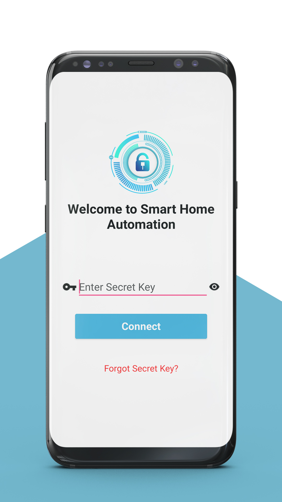&nbsp;&nbsp;&nbsp;&nbsp;&nbsp;&nbsp;&nbsp;&nbsp;&nbsp;&nbsp;&nbsp;&nbsp;&nbsp;&nbsp;&nbsp;&nbsp;&nbsp;
  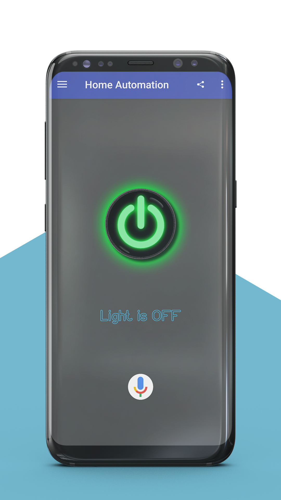&nbsp;&nbsp;&nbsp;&nbsp;&nbsp;&nbsp;&nbsp;&nbsp;&nbsp;&nbsp;&nbsp;&nbsp;&nbsp;&nbsp;&nbsp;&nbsp;&nbsp;
  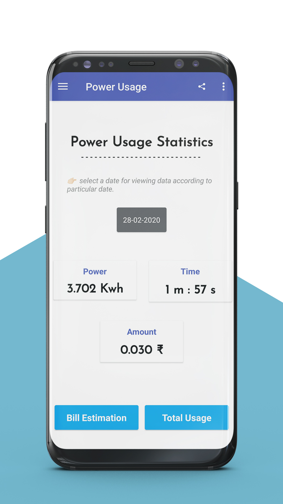

  

  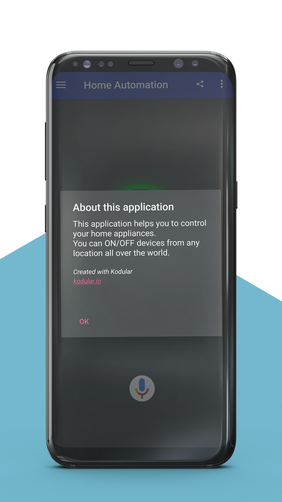&nbsp;&nbsp;&nbsp;&nbsp;&nbsp;&nbsp;&nbsp;&nbsp;&nbsp;&nbsp;&nbsp;&nbsp;&nbsp;&nbsp;&nbsp;&nbsp;&nbsp;
  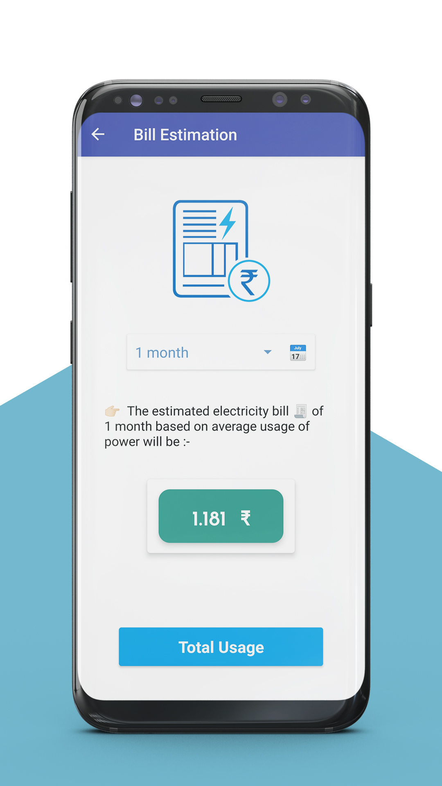&nbsp;&nbsp;&nbsp;&nbsp;&nbsp;&nbsp;&nbsp;&nbsp;&nbsp;&nbsp;&nbsp;&nbsp;&nbsp;&nbsp;&nbsp;&nbsp;&nbsp;
  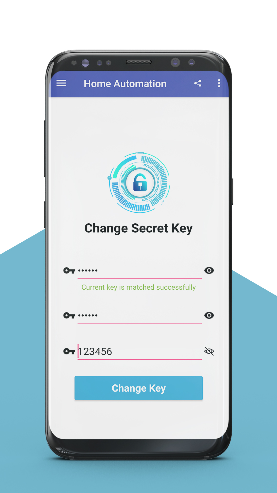

  

  &nbsp;&nbsp;&nbsp;&nbsp;&nbsp;&nbsp;&nbsp;&nbsp;&nbsp;&nbsp;&nbsp;&nbsp;&nbsp;&nbsp;&nbsp;&nbsp;&nbsp;
  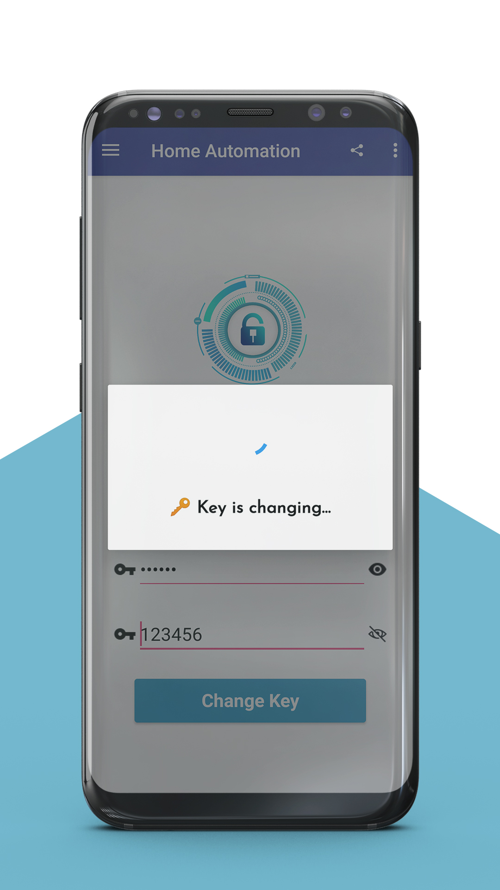&nbsp;&nbsp;&nbsp;&nbsp;&nbsp;&nbsp;&nbsp;&nbsp;&nbsp;&nbsp;&nbsp;&nbsp;&nbsp;&nbsp;&nbsp;&nbsp;&nbsp;
  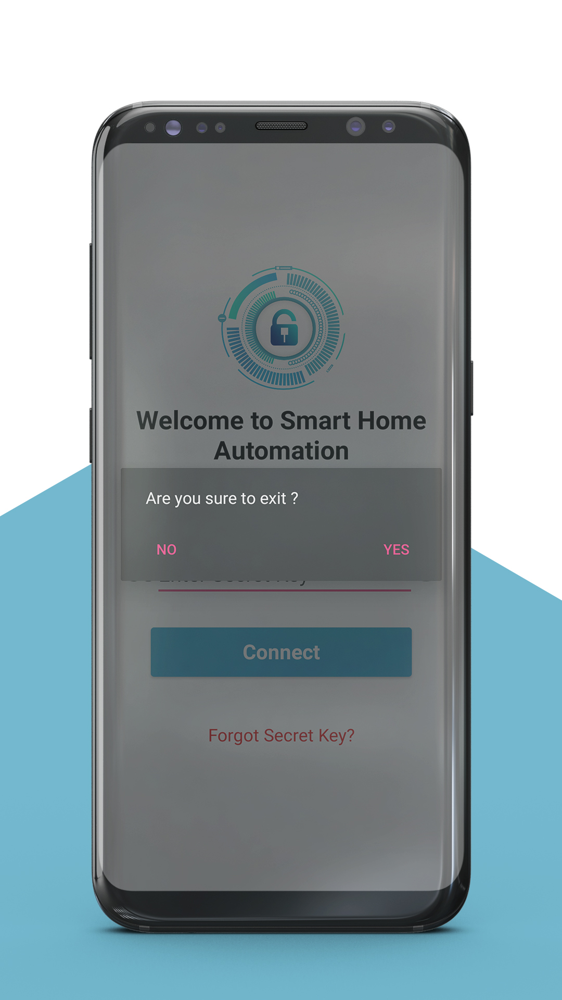

  

  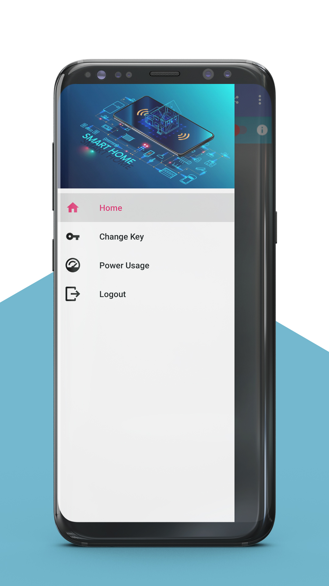&nbsp;&nbsp;&nbsp;&nbsp;&nbsp;&nbsp;&nbsp;&nbsp;&nbsp;&nbsp;&nbsp;&nbsp;&nbsp;&nbsp;&nbsp;&nbsp;&nbsp;
  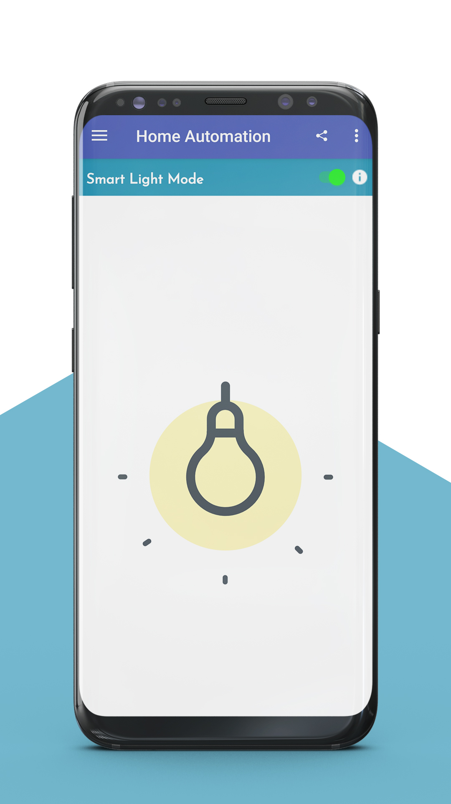&nbsp;&nbsp;&nbsp;&nbsp;&nbsp;&nbsp;&nbsp;&nbsp;&nbsp;&nbsp;&nbsp;&nbsp;&nbsp;&nbsp;&nbsp;&nbsp;&nbsp;
  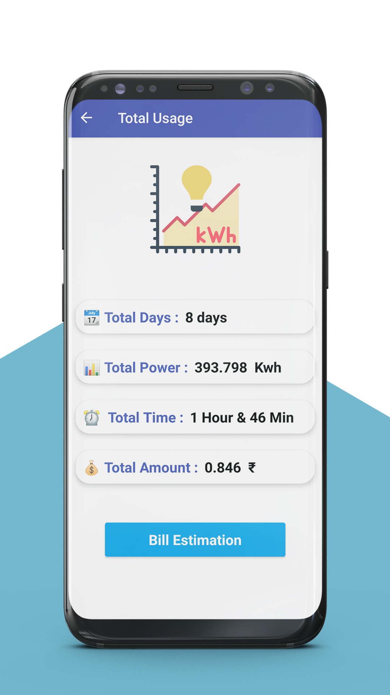

