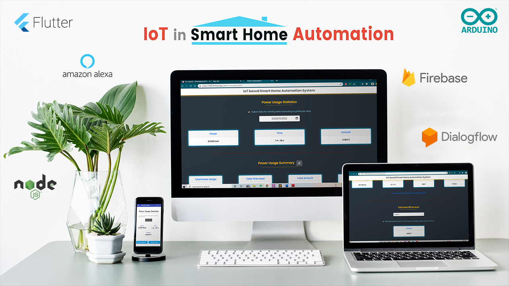
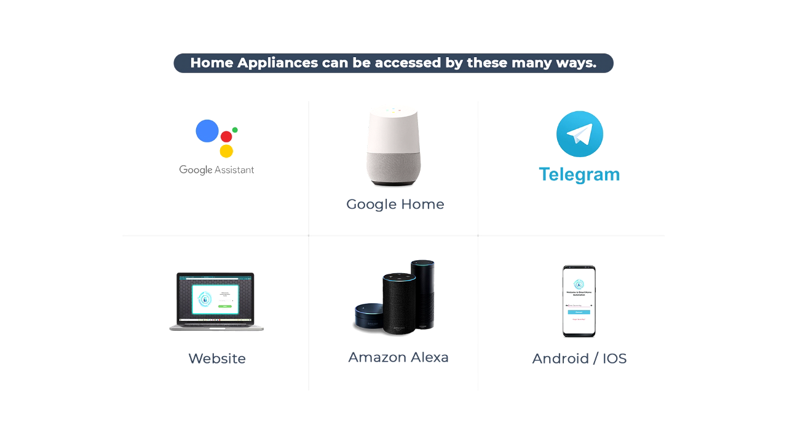
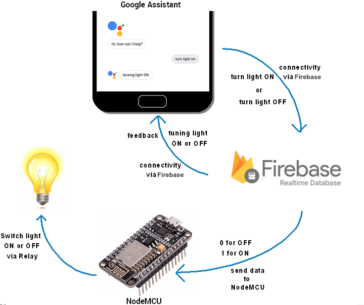
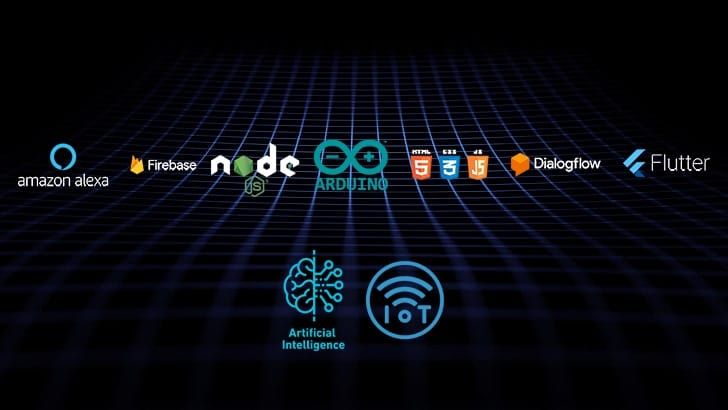

  

# IoT Smart Home Automation ✨

<ul>
  <li>This repository contains all the files and required packages related to IoT Smart Home Automation project.</li>
</ul>
 

##  [IoT Smart Home Automation Project Full Demo Video](https://youtu.be/u44gbTO9PWA)
 

## 📟 Project Preview :

  

 

🟢 [Click Here to download APK](https://github.com/abhijain2472/IoT-Smart-Home-Automation/raw/master/APK/Home%20Automation.apk) 📲 (PIN: 123456)
  
🟢 [Click Here to go to website](https://iottest-7498a.firebaseapp.com) 🖥️ (PIN: 123456)

 

## ℹ️ Inroduction :

<ul>
  <li>IoT Smart Home Automation is a solution that enable us to control our home appliaces through Mobile, PC/Laptop, Alexa, Google Assistant and Telegram. This project even provides user to monitor power consumption of respective devices.</li>
  <li>The purpose of our IoT Smart Home Automation is to provide a technological tool for today’s techno savvy that provide various functions which are significantly useful in current world for saving and efficiently using electricity.</li>
</ul>

## 🎨 Features :

<ul>
  <li>User can control home appliance in following ways:
    <ul>
      <li>Mobile</li>
      <li>PC/Laptop</li>
      <li>Google Assistant</li>
      <li>Amazon Alexa</li>
      <li>Telegram</li>
      <li>FB Messenger</li>
    </ul>
  </li>
   
  <li>User can keep track of power consumption of the appliances:
    <ul>
      <li>Show estimated bill based on previous usage.</li>
      <li>Consumption data can be filtered by date.</li>
    </ul>
  </li>
  <li>Smart light mode:
    <ul>
      <li>This feature is implemented using PIR Motion Sensor which detects movement of leaving objects. Thus when any person is in the range of sensor, light will be turned on otherwise turned off automatically.</li>
    </ul>
  </li>
</ul>

  

## 📊 Circuit Diagram :

  

  

## 🤖 Technologies :

  

 

## ⚙️ Hardwares used :

<ul>
  <li><a target="_blank" href="https://www.amazon.in/Easy-Electronics-NodeMcu-Development-Board/dp/B06XYRS6KC/ref=sr_1_1?dchild=1&keywords=s+8266&qid=1598761236&sr=8-1">Node-MCU ESP8266</a></li>
  <li><a href="https://www.amazon.in/Generic-ACS712-Current-Sensor-Module/dp/B00NU8XD80/ref=sr_1_1?dchild=1&keywords=Current+Sensor+ACS712&qid=1598761326&sr=8-1" target="_blank">Current Sensor ACS712</a></li>
  <li><a href="https://www.amazon.in/AusleseTM-Channel-Module-Raspberry-Trigger/dp/B08C7W3B41/ref=sr_1_2?dchild=1&keywords=Relay+Module&qid=1598761358&sr=8-2" target="_blank">Relay Module</a></li>
  <li><a href="https://www.amazon.in/Robodo-SEN3-Pyroelectric-Infrared-Detector/dp/B073Q399F6/ref=sr_1_6?dchild=1&keywords=PIR+Motion+Sensor&qid=1598761388&sr=8-6" target="_blank">PIR Motion Sensor</a></li>
  <li><a href="https://www.amazon.in/ApTechDeals-Jumper-Female-breadboard-jumper/dp/B074J9CPV3/ref=sr_1_1?dchild=1&keywords=Male-Female+wires&qid=1598761452&sr=8-1" target="_blank">Male-Female Wires</a></li>
  <li>100W Bulb</li>
  <li>Powerbank</li>
</ul>

## 📱 Some Screenshots :

 &nbsp;&nbsp;&nbsp;&nbsp;&nbsp;&nbsp;&nbsp;&nbsp;&nbsp;&nbsp;&nbsp;&nbsp;&nbsp;&nbsp;&nbsp;&nbsp;&nbsp;
  &nbsp;&nbsp;&nbsp;&nbsp;&nbsp;&nbsp;&nbsp;&nbsp;&nbsp;&nbsp;&nbsp;&nbsp;&nbsp;&nbsp;&nbsp;&nbsp;&nbsp;
  

  

  &nbsp;&nbsp;&nbsp;&nbsp;&nbsp;&nbsp;&nbsp;&nbsp;&nbsp;&nbsp;&nbsp;&nbsp;&nbsp;&nbsp;&nbsp;&nbsp;&nbsp;
  &nbsp;&nbsp;&nbsp;&nbsp;&nbsp;&nbsp;&nbsp;&nbsp;&nbsp;&nbsp;&nbsp;&nbsp;&nbsp;&nbsp;&nbsp;&nbsp;&nbsp;
  

  

  &nbsp;&nbsp;&nbsp;&nbsp;&nbsp;&nbsp;&nbsp;&nbsp;&nbsp;&nbsp;&nbsp;&nbsp;&nbsp;&nbsp;&nbsp;&nbsp;&nbsp;
  &nbsp;&nbsp;&nbsp;&nbsp;&nbsp;&nbsp;&nbsp;&nbsp;&nbsp;&nbsp;&nbsp;&nbsp;&nbsp;&nbsp;&nbsp;&nbsp;&nbsp;

  &nbsp;&nbsp;&nbsp;&nbsp;&nbsp;&nbsp;&nbsp;&nbsp;&nbsp;&nbsp;&nbsp;&nbsp;&nbsp;&nbsp;&nbsp;&nbsp;&nbsp;
  &nbsp;&nbsp;&nbsp;&nbsp;&nbsp;&nbsp;&nbsp;&nbsp;&nbsp;&nbsp;&nbsp;&nbsp;&nbsp;&nbsp;&nbsp;&nbsp;&nbsp;

## 🤝🏻 Project Team :

**1.  Abhishek Jain (abhishekjain2472@gmail.com)**
  &nbsp;&nbsp;&nbsp;
  &nbsp;&nbsp;&nbsp;
  &nbsp;&nbsp;&nbsp;
  &nbsp;&nbsp;&nbsp;
   
**2.  Dhruv Patel (dhruvap.2610@gmail.com)**
  &nbsp;&nbsp;&nbsp;
  &nbsp;&nbsp;&nbsp;
  &nbsp;&nbsp;&nbsp;
  &nbsp;&nbsp;&nbsp;
   
**3.  Raj Sathawara (rajsathawara@gmail.com)**
  &nbsp;&nbsp;&nbsp;
  &nbsp;&nbsp;&nbsp;
  &nbsp;&nbsp;&nbsp;
  &nbsp;&nbsp;&nbsp;

## 📷 Graphic Designer & Video Editing :

**1.  Viraj Patel (pviraj98@gmail.com)**
  &nbsp;&nbsp;&nbsp;
  &nbsp;&nbsp;&nbsp;
  &nbsp;&nbsp;&nbsp;
  &nbsp;&nbsp;&nbsp;
